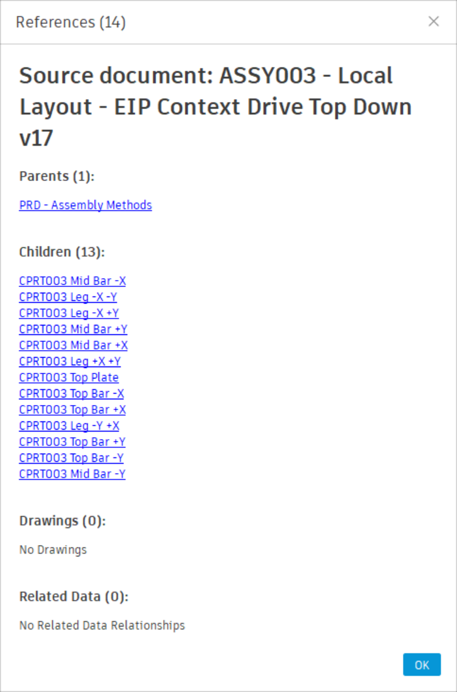

# Document References

[Back to Readme](../README.md)

## Description

**Document References** reports all inbound and outbound data relationships for the active document in a single dialog. Relationships are grouped by type with a count for each group and a total count in the dialog title.

| Group | Contents |
|---|---|
| **Parents** | Documents this document references (source files inserted as external references) |
| **Children** | Documents that reference this document |
| **Drawings** | `.f2d` drawing documents associated with this document |
| **Related Data** | Related documents created by the **Create Related Data** command (identified by the `‹+›` marker in their name) |

---

## Access

**Document References** is in the **Power Tools** panel on the **Power Tools** tab of the **Design Workspace**.

---

[Back to Readme](../README.md)

IMA LLC Copyright
