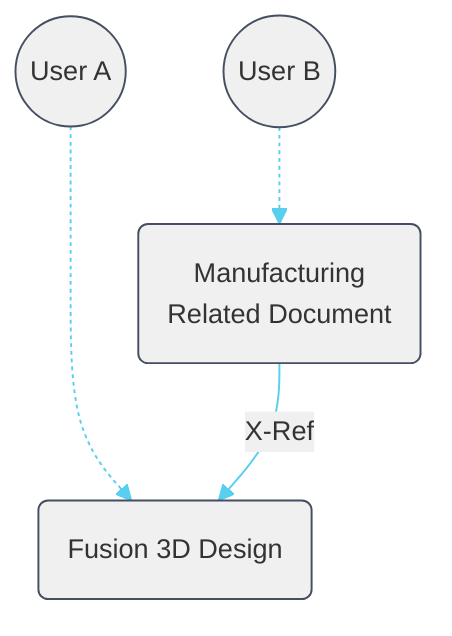
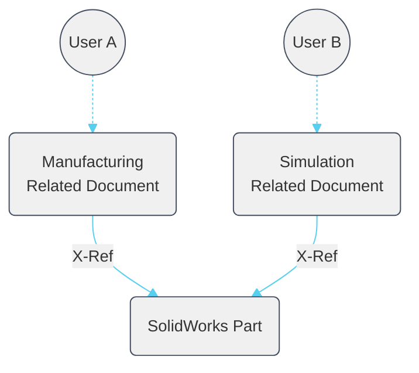
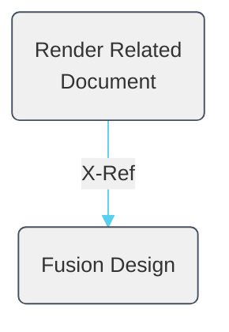
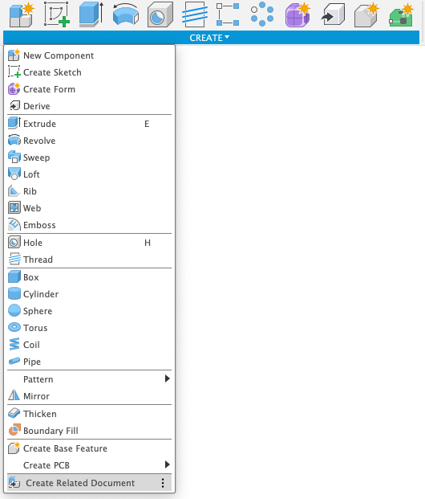
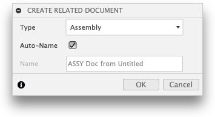
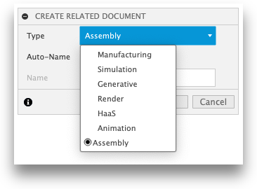

# Create Related Data

[Back to Readme](../README.md)

## Overview

**Create Related Data** is a Fusion add-in command in the **Design Workspace → Create Panel** that copies a pre-configured template document from your Team Hub and inserts the active source document as an external reference inside it.

The result is a *related document* — a separate file that references your source design without locking or modifying it. Multiple team members can work in their own related documents simultaneously. Each document's lifecycle, permissions, and workspace can be managed independently.

When creating the new related document, select from a configurable list of templates stored in your hub. The add-in auto-names the new document using the pattern `<source name> ‹+› <template name>`, making the relationship clear at a glance. You can disable auto-naming to provide a custom name.

> **Requirement:** The source document must be saved before you can use this command.

---

## Use cases

### Manufacture a native Fusion 3D design

Create a Manufacturing related document so a CNC programmer can work in parallel without locking or modifying the original design. When you share your design file, manufacturing setups and toolpaths stay private in their own separate document.



### AnyCAD — reference an uploaded non-native file

Upload a SolidWorks (or other CAD) file through Fusion Team, then use this add-in to create Manufacturing or Simulation related documents that reference it. When the source file is updated and saved, the related document can update to the new version.



Two related documents — one for Manufacturing, one for Simulation — each with a dedicated user working in parallel. This allows different disciplines to work concurrently without permission conflicts.

> **Note:** AnyCAD workflows require a Team Hub and a Commercial, Education, or Start-Up entitlement. Personal (free/hobby) entitlements do not include AnyCAD.

### Render designs with a consistent look

Store lighting rigs, exposure settings, HDRI environments, and camera presets inside a Render template document. Every new render document created from that template starts with a consistent, pre-configured look.



---

## Template documents

Template documents are `.f3d` files stored in a dedicated folder inside a Team Hub project. The add-in lists every `.f3d` file in that folder as a selectable **Type** when you run the command.

### What to include in a template

- **Active workspace** — Fusion preserves the active workspace when saving, so the new document opens directly in the correct workspace (Design, Manufacture, Simulation, Render, and so on).
- **Machine definitions, posts, and fixtures** for Manufacturing templates.
- **Material and appearance libraries** for assembly templates.
- **Lighting rigs, render settings, and camera presets** for Render templates.
- **Document units preference.**

### Example template set

| Template name | Purpose |
|---|---|
| `MFG - Haas.f3d` | Manufacture workspace with Haas machine, post, and fixture pre-loaded |
| `MFG - Plasma.f3d` | Manufacture workspace with plasma cutter setup and toolpaths |
| `ASSY - in.f3d` | Empty assembly in inches |
| `ASSY - mm.f3d` | Empty assembly in millimetres |
| `VIZ.f3d` | Render studio with custom lighting and floor stage elements |

> **Tip:** Always include a generic empty assembly template so users can create a plain related document when no specialist template is needed.

---

## Setup

### Step 1 — Create the Templates project and folder in Fusion Team

> This step is best performed by a Fusion Team administrator.

1. Sign in to [Fusion Team](https://www.autodesk.com/fusion-team).
2. Create a new project — recommended name: **Templates**.
3. Set project permissions so all team members can access it — use the _All Users_ group or equivalent folder-level permissions.
4. Inside the project, create a folder — recommended name: **Related Data** or **Start Parts**.
5. Create or upload `.f3d` documents into that folder — one file per workflow.

### Step 2 — Configure the hub (once per machine and hub)

The **Configure Hub** command reads the open document's hub, project, and folder automatically. No manual JSON editing is required.

See the [Configure Hub](./Configure%20Hub.md) documentation for the full walkthrough.

In brief:

1. Open any `.f3d` document already saved inside your templates folder.
2. Run **Configure Hub** from the **Quick Access Toolbar → File menu → PowerTools Settings** flyout.
3. Review the detected Hub, Project, and Folder in the confirmation dialog, then click **OK**.

The hub configuration is written to `hub.json` at the add-in root. Multiple hubs can be configured — run **Configure Hub** once for each hub.

### Step 3 — Use the command

1. Open the source document you want to reference. The document must be saved.
2. Run **Create Related Data** from the **Design Workspace → Create Panel**.
3. Select a template from the **Type** drop-down.
4. By default, the new document is auto-named as `<source name> ‹+› <template name>`. Clear **Auto-Name** to enter a custom name.
5. Click **OK**. The add-in creates the new related document, saves it in the same folder as the source document, and inserts the source document as an external reference.







---

## Template cache

After the first successful run, the add-in saves a local cache file at `cache/<hub-id>.json` that lists all templates found in the configured folder. Subsequent runs load from the cache instead of querying the API, which makes the dialog open faster.

**To refresh the cache** — for example, after adding or renaming templates:

Delete the relevant `.json` file from the `cache/` folder at the add-in root. The next run re-queries the templates folder and rebuilds the cache automatically.

---

## Architecture

### How the command works

When you run **Create Related Data**, the add-in follows this sequence:

1. Reloads the in-memory hub configuration from `hub.json` to pick up any recently added hubs.
2. Checks whether the active hub ID is in the configured hub list. If it is not, an error message is displayed.
3. Calls `_load_templates_for_hub()`, which checks for a local cache file at `cache/<hub-id>.json`. On a cache hit, templates are loaded from disk. On a cache miss, templates are fetched from the Fusion API, then written to the cache for future use.
4. Verifies that the source document is saved.
5. Presents the command dialog with a **Type** drop-down listing all available templates and an **Auto-Name** toggle.
6. When the user selects a template, the document name field updates automatically to `<source name> ‹+› <template name>`.
7. On confirmation (OK):
   - Opens the selected template document from the hub.
   - Saves it as a new document with the specified name, into the same folder as the source document.
   - Inserts the source document into the new document's root component as an external reference (X-Ref).
   - Saves the new document.

### System context

```mermaid
C4Context
  title System Context — Create Related Data

  Person(user, "Fusion User", "Has a saved source document open in Fusion")

  System_Boundary(addin, "PowerTools Add-in") {
    System(relatedData, "Create Related Data Command", "Copies a template, inserts the source document as an external reference, and saves the new document")
  }

  SystemDb(hubJson, "hub.json", "Local configuration file — registered hub, project, and folder IDs")
  SystemDb(cache, "Template Cache", "cache/<hub-id>.json — cached list of available templates per hub")
  SystemExt(fusionTeam, "Autodesk Fusion Team", "Hosts hub data, template .f3d files, and the destination folder for new documents")

  Rel(user, relatedData, "Selects template, optionally sets name, clicks OK")
  Rel(relatedData, hubJson, "Reads hub and folder configuration")
  Rel(relatedData, cache, "Reads template list; writes cache on first fetch")
  Rel(relatedData, fusionTeam, "Fetches templates (cache miss); opens template document; saves new document")
```

### Container detail

```mermaid
C4Container
  title Container Diagram — Create Related Data

  Person(user, "Fusion User")

  Container_Boundary(addin, "PowerTools Add-in") {
    Container(cmdCreated, "command_created handler", "Python / Fusion API", "Validates the active hub; loads templates via _load_templates_for_hub(); builds the Type drop-down and Auto-Name toggle")
    Container(cmdInputChanged, "command_input_changed handler", "Python", "Updates the document name field when the user changes the Type or toggles Auto-Name")
    Container(cmdExecute, "command_execute handler", "Python / Fusion API", "Opens the selected template; saves as new document with X-Ref to source; saves the new document")
    Container(loadTemplates, "_load_templates_for_hub()", "Python / json", "Returns templates from cache or fetches from Fusion API and writes cache on miss")
    Container(configModule, "config.py", "Python", "In-memory COMPANY_HUB list and COMPANY_HUB_CONFIGS map loaded from hub.json")
  }

  SystemDb(hubJson, "hub.json", "Local JSON configuration file")
  SystemDb(cache, "cache/<hub-id>.json", "Local template cache file per hub")
  SystemExt(fusionApi, "Fusion API (adsk.core / adsk.fusion)", "Provides documents.open(), document.saveAs(), occurrences.addByInsert(), dataProjects, dataFolders")

  Rel(user, cmdCreated, "Clicks Create Related Data")
  Rel(cmdCreated, configModule, "Calls reload_hub_config(); checks COMPANY_HUB")
  Rel(cmdCreated, loadTemplates, "Calls _load_templates_for_hub(hub_id)")
  Rel(loadTemplates, cache, "Reads cache on hit; writes cache on miss")
  Rel(loadTemplates, fusionApi, "Fetches folder contents on cache miss")
  Rel(cmdCreated, cmdInputChanged, "Fires on Type or Auto-Name change")
  Rel(cmdCreated, cmdExecute, "Fires on OK")
  Rel(cmdExecute, fusionApi, "Opens template; saves new document; inserts X-Ref")
  Rel(configModule, hubJson, "Reads hub entries on load or reload")
```

---

## Access

**Create Related Data** is in the **Design Workspace → Create Panel** (Assembly tab and Solid tab) and is promoted to the main toolbar by default.

You can also pin it to the **Shortcuts** (S-key menu) for faster access.

---

Thanks to contributions from:

- [TheEppicJR](https://github.com/TheEppicJR)

[Back to Readme](../README.md)

Copyright IMA LLC. All rights reserved.
